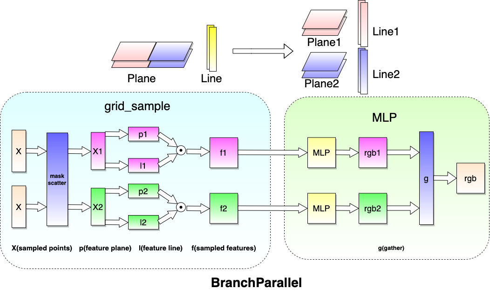
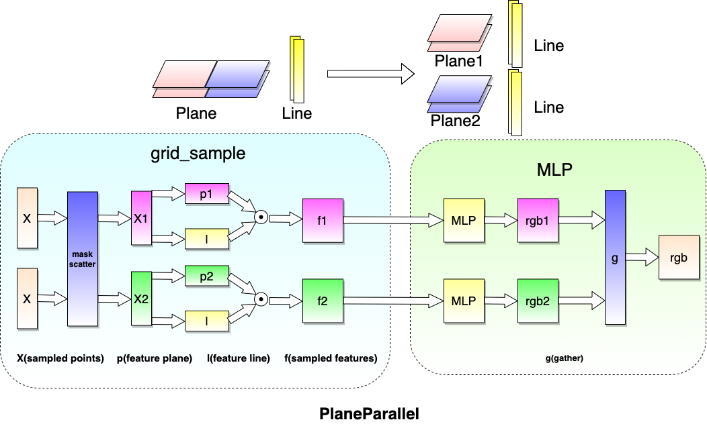
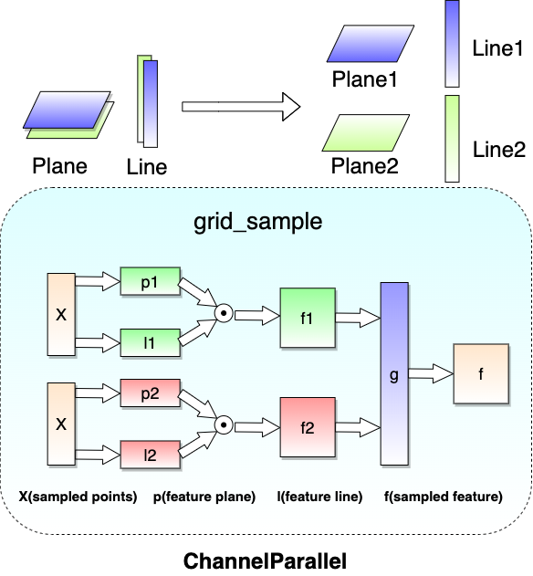

    <picture>
    
    </picture>

  🌏NeRF the globe if you want  

# Introduction
There are many one-of-a-kind highlights in the LandMark:

- Large-scale, high-quality novel view rendering:
    - For the first time, we realized efficient training of 3D neural scenes on over 100 square kilometers of city data; and the rendering resolution reached 4K. We used over 200 billions learnable parameters to model the scene.
- Multiple feature extentions:
    - Beyond rendering, we showcased layout adjustment such as removing or adding a buildings, and scene stylization with alternative appearance such as changes of lighting and seasons.
- Training, rendering integrated system:
    - We delivered a system covering algorithms, operators, computing systems, which serves as a solid foundation for the training, rendering and application of real-world 3D large models.

The LandMark supports multiple types of parrllel strategies. With the strategies, we achieve huge NeRF speedups and make the NeRF truly applicable to city-scale reconstruction. These parallel strategies mainly include the following types:

- [Introduction](#introduction)
- [Branch Parallel](#branch-parallel)
- [Plane Parallel](#plane-parallel)
- [Channel Parallel](#channel-parallel)

Here we present how our Parallel methods work. Basic knowledges of NeRFs are needed for better understanding.
# Branch Parallel

<picture>
    
</picture>

The scene area is divided into multiple scene blocks. Correspondingly, the model changes from having a single large grid to multiple sub-grids. with each sub-grid representing a scene block. 

All sub-grids share the same MLPs to decode features and ouput rgbσ. All the sub-grid and the shared MLPs consitiute a complete multi-branch large model. 

When a point sampled along the ray is fed into the multi-branch model, it is first assigned to the corresponding sub-grid based on its coordinate, and then inferred with this branch.

<picture>
    
</picture>

# Plane Parallel

Plane parallel devides the full plane into multiple sub-plane, and then scatters to different devices. Thus, each device holds a part of the full plane. Apart from the plane, the remaining modules are replicated across all devices, and their parameters are shared among all devices.

During training, when a point sampled along the ray is fed into the model, it is first assigned to the sub-plane and the corresponding device based on its x-y coordinate. and then inferred on the device to get its rgbσ value. After inferring a batch of points, the rgbσ value are gathered across all devices.

After training with plane parallel, the weights of all sub-planes can be merged into a full plane. In this way, the model trained with plane parallel can be rendered just like a single model.

Alternatively, the plane weights keep seperate without merge, then the model is rendered just follows the infering way in training.

<picture>
    
</picture>

# Channel Parallel

In Channel Parallel, both feature plane and feature line are sharded along the channel dimension. The features computed by grid_sample are also sharded along the channel dimension. Then we can get a full-channel feature if we do gather/all-gather on these sharded features.

<picture>
    
</picture>

